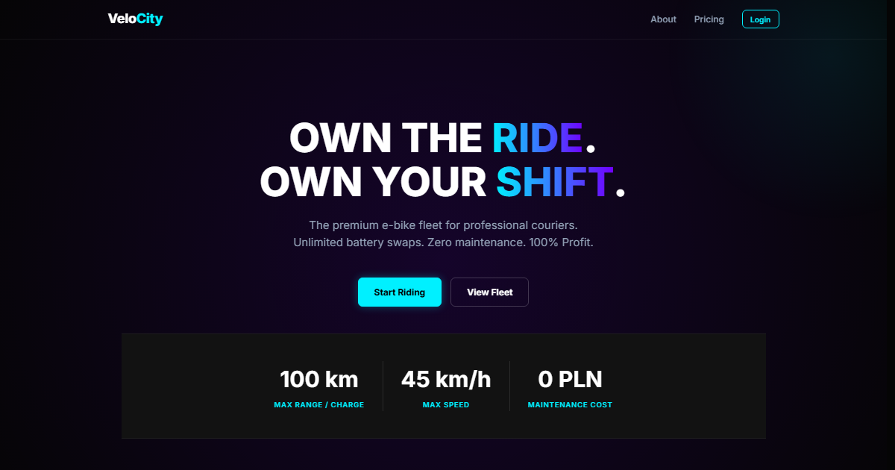

# VeloCity — Client

[](https://github.com/jakub-jurkian/velocity-client/actions/workflows/ci.yml)

React 19 and TypeScript frontend for **VeloCity**, a platform for renting courier e-bikes by the day. It talks to a Java / Spring Boot API: [velocity-api](https://github.com/jakub-jurkian/velocity-api).

**Live:** [www.velocityfleet.dev](https://www.velocityfleet.dev)



---

## What it does

**Riders**

- Register and log in; "Remember me" keeps the session across browser restarts, otherwise it ends with the tab.
- Book a bike in three steps: pick dates (3 to 21 days, starting tomorrow), choose from the bikes actually free in your city for those dates, then confirm against a price the server quotes, including the duration discount.
- See your ride history page by page, export all of it as CSV, and cancel a booking before it starts. If staff cancelled one, the card says so and why.
- Edit your name, phone number and city.

**Admins**

- A dashboard with total revenue, how much of the fleet is out right now, a monthly revenue trend and model popularity.
- User management: edit details, change roles, block and unblock accounts.
- Fleet management: filter bikes by status and change it. If a change would cancel live bookings, the server refuses it first, and the admin sees exactly whose rides are affected before confirming.

---

## Engineering decisions

- **The server owns money and availability.** The availability search returns a server-priced quote and the client only renders it, so the total shown can never drift from the one stored. A double booking is stopped by the database; when two riders race for the same bike, the loser gets a 409 and the wizard re-runs the search so they pick from what is still free.
- **Optimistic locking with an honest UI.** A bike's status change carries its `version`. The API answers 409 for two different reasons, a stale version or live bookings in the way, and the client tells them apart by the body: a stale version refreshes the list, live bookings open a second confirmation listing each one.
- **One API client.** [`apiFetch`](src/api/client.ts) adds the base URL and bearer token, handles JSON, and turns RFC 7807 errors into an `ApiError` whose per-field messages land on the matching form inputs. A 401 on the stored session ends it once, app-wide, instead of every page failing on its own.
- **Lists that stay correct.** Every list endpoint is paginated. [`usePaginatedList`](src/hooks/usePaginatedList.ts) keeps the page's `meta` and aborts the previous request whenever the page or filter changes, so a fast double click can never show an older page.
- **A small shared UI kit.** [`src/components/ui`](src/components/ui) holds the Button (with a built-in in-flight spinner), Modal and ConfirmDialog, form fields, a DataTable that becomes cards on phones, and a dozen smaller pieces. Styles are SCSS modules on one theme of tokens and mixins. Consolidating the pages onto it cut the SCSS by 40%.
- **Loading only what a visitor needs.** Public pages ship in the main bundle; the signed-in pages and the admin area (with Recharts) are separate chunks. framer-motion runs through `LazyMotion`, and the Inter font is self-hosted. The initial JavaScript fell from 472 kB to 382 kB (155 kB to 129 kB gzipped) and the initial CSS from 51 kB to 25 kB.
- **Accessible by default.** Dialogs trap focus and hand it back when they close, every page has a skip link, field errors are announced through `aria-describedby`, and animations respect reduced motion.
- **Deployed with care.** [`vercel.json`](vercel.json) sets a Content Security Policy and other security headers, and caches the hashed assets for a year. Logging out revokes the token on the server, not just in the browser.

---

## Tech stack

- **Core:** React 19, TypeScript 5.9, Vite 7
- **State and routing:** Redux Toolkit, React Router 7
- **UI:** SCSS Modules, Framer Motion, React Hot Toast, Recharts, date-fns
- **Quality:** ESLint, and GitHub Actions running lint, type-check and build on every push
- **Hosting:** Vercel

---

## Project structure

```
src/
  api/          apiFetch, ApiError, paginated fetch helpers
  components/
    ui/         shared kit: Button, Modal, Form fields, DataTable, ...
    MainLayout/ navbar, footer and page shell
    AuthLayout/ shared log in / register card
    common/     error boundary, page transition, route helpers
  data/         cities and hubs, fleet catalogue, rental limits
  hooks/        useForm, usePaginatedList, useCheckout, useLogout
  pages/        one folder per route, admin pages under Admin/
  store/        Redux store and the auth slice
  styles/       theme tokens, mixins and globals
  types/        API response types
  utils/        formatting, validation and small helpers
```

---

## Running it locally

**Prerequisites:** Node.js 22.12 or newer, and a running [velocity-api](https://github.com/jakub-jurkian/velocity-api).

```bash
git clone https://github.com/jakub-jurkian/velocity-client.git
cd velocity-client
npm install
cp .env.example .env   # then set VITE_API_URL
npm run dev
```

The app runs at http://localhost:5173 and calls the API at `VITE_API_URL` (the example points at `http://localhost:8080`).

| Script            | What it does                                                |
| ----------------- | ----------------------------------------------------------- |
| `npm run dev`     | Development server with hot reload                          |
| `npm run build`   | Type-check, then a production build into `dist/`            |
| `npm run preview` | Serve the production build locally                          |
| `npm run lint`    | ESLint over the whole project                               |

`npm run build` stops with an error if `VITE_API_URL` is unset. Vite would otherwise inline the word `undefined` into every API URL and the site would fail in confusing ways.

---

## Deploying

On Vercel, set `VITE_API_URL` to the API's origin (e.g. `https://api.velocityfleet.dev`). `vercel.json` already rewrites every route to `index.html` for client-side routing. If the API moves to another origin, update `connect-src` in the Content Security Policy there too, or the browser will block the calls.

---

## License

MIT
